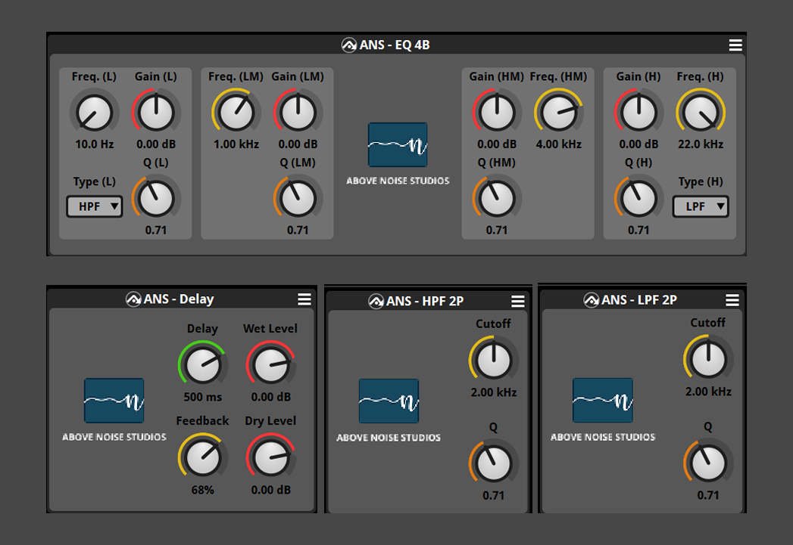

# FMOD CMake Plugins

A CMake template project for developing custom FMOD DSP plugins in C++.

[](https://github.com/horacv/FmodCMake_Plugins/actions/workflows/build-test.yml)



## Overview

This project provides a structure for creating cross-platform FMOD DSP plugins in C++.
It contains the boilerplate code required to interface with FMOD's DSP callback API, and defines a clean separation between interface, state, and data.
DSP helper functions are implemented in a standalone testable shared library.

## Prerequisites

- CMake 3.30 or higher
- FMOD Core API ([download here](https://www.fmod.com/download))
- C++20 compatible compiler

## Getting Started

1. Clone the repository:
   ```
   git clone https://github.com/horacv/FmodCMake_Plugins.git
   cd FmodCMake_Plugins
   ```
2. Download the [FMOD Core API](https://www.fmod.com/download) and set it up using the scripts in `tools/` (or place it manually — see `libs/fmod/`).
3. Configure and build with CMake (see commands below).

### CMake build commands

- Debug: `cmake -B build/debug -DCMAKE_BUILD_TYPE=Debug && cmake --build build/debug`
- Release: `cmake -B build/release -DCMAKE_BUILD_TYPE=Release && cmake --build build/release`

## Project Structure

```
.
├── CMakeLists.txt        # Main CMake configuration
├── libs/                 # Helper libraries for DSP processing
│   ├── ans_dsp/          # Base DSP functionality
│   ├── ans_fmod_dsp/     # FMOD-specific DSP utilities
│   └── fmod/             # FMOD API headers and libraries
├── plugins/              # DSP plugin implementations
│   ├── passthrough/      # Example plugin — no processing
│   ├── gain/             # Gain / trim
│   ├── lpf_1p/           # One-pole low-pass filter
│   ├── hpf_1p/           # One-pole high-pass filter
│   ├── lpf_2p/           # Two-pole low-pass filter
│   ├── hpf_2p/           # Two-pole high-pass filter
│   ├── eq_4b/            # 4-band parametric EQ
│   └── delay/            # Delay / echo
├── fmod_project/         # FMOD Studio project files (empty, ignored by default)
└── tools/                # Python scripts for setting up the FMOD API
```

## Plugin Examples

| Plugin | Description |
|---|---|
| `passthrough` | Minimal example plugin; passes audio through unmodified. Good starting point for a new plugin. |
| `gain` | Simple gain/trim with parameter smoothing. |
| `lpf_1p` / `hpf_1p` | One-pole low-pass and high-pass filters. |
| `lpf_2p` / `hpf_2p` | Two-pole (biquad) low-pass and high-pass filters. |
| `eq_4b` | 4-band parametric EQ using cascaded biquads (low shelf, two peaking bands, high shelf). |
| `delay` | Delay/echo with feedback, built on a circular ring buffer. |

More plugins (tremolo, saturation/waveshaper, compressor/limiter) are planned as the curriculum progresses.

## Adding a New Plugin

1. Add a new subdirectory under `plugins/`, modeled on `passthrough/` or an existing plugin.
2. Replace the namespace name with the name of your plugin, not the classes.
3. Write your DSP processing in the '_state' class.
4. Write the UI definition in the '.plugin.js' file.
5. Register the new plugin target in `CMakeLists.txt`.

## Using Plugins in FMOD Studio

1. Open FMOD Studio.
2. Create a new project or open an existing one.
3. Go to Edit -> Preferences -> Assets.
4. In the Plug-ins folder input the folder where the .dlls of your plugins are built Example: `C:/FmodCMake_Plugins/build/debug`.
5. Enjoy.

## Documentation

- [FMOD Studio API Getting Started](https://www.fmod.com/docs/2.03/api/studio-api-getting-started.html)
- [CMake Documentation](https://cmake.org/)
- [Audio EQ Cookbook (Bristow-Johnson)](https://www.w3.org/TR/audio-eq-cookbook/) — reference for biquad coefficient math used throughout `eq_4b` and the filter plugins
